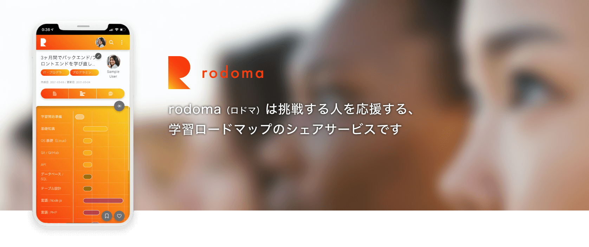

# rodoma

## 概要

本リポジトリは、WEB サービス「rodoma（ロドマ）」のフロントエンド環境のリポジトリです。

**各リポジトリ**

- フロントエンド [rodoma-frontend](https://github.com/kentsunekawa/rodoma-frontend)（※ 本リポジトリ）
- バックエンド [rodoma-backend](https://github.com/kentsunekawa/rodoma-backend)
- 開発環境（Docker Compose）[rodoma-project](https://github.com/kentsunekawa/rodoma-project)

## サービス紹介

**挑戦する人を応援する、学習ロードマップのシェアサービス**

rodoma（ロドマ）は、新しいことを勉強しようとしているけれど、どう進めたらいいかわからない人のための、学習のロードマップシェアサービスです。

#### ユーザーメリット（学ぶ人）

これから学ぼうとしている人は、先輩や現役の人たちが公開する学習方法やロードマップを見ることができ、またそれに紐づく教材（書籍、記事、動画）にアクセスすることができます。

#### ユーザーメリット（投稿する人）

ロードマップを公開する人は、学ぶ人を支援するという名目だけでなく、  
自分が書いたブログの記事や運営する YouTube チャンネル、書籍を出しているならその販売ページ、オンラインサロンを運営しているならその WEB サイトの URL を記載することで、販売チャネルの一つとしても活用できます。

また、フォロー機能やコメント機能といった SNS としての機能も備えているので、人脈を広げるきっかけを作ることも可能です。  
rodoma は見る人にとっても投稿する人にとっても、キャリアを形成する上でメリットがある、そんなサービスです。

## 主な機能一覧

| 分類                 | 機能                                                                                 |
| -------------------- | ------------------------------------------------------------------------------------ |
| ユーザー             | 新規登録、サインイン、サインアウト、ユーザー情報編集、メール認証、パスワードリセット |
| 投稿                 | 閲覧、新規作成、保存、公開、限定公開、アイキャッチ画像設定                           |
| 投稿検索・ソート     | キーワードで検索、カテゴリで検索、ソート（Like 数 / Mark 数 / 作成日）               |
| ユーザー検索・ソート | キーワードで検索、カテゴリで検索、ソート（フォロワー数 / 登録日）                    |
| コメント             | コメント作成、コメント削除                                                           |
| Like（ライク）       | 良いと思った投稿に Like する、Like の解除                                            |
| Mark（マーク）       | 後で見たい投稿に Mark する、Mark の解除                                              |
| フォロー             | フォロー、フォロー解除                                                               |
| その他               | 無限スクロール、ライトモード / ダークモード                                          |

## 使用技術・アーキテクチャー

### 概要

#### SPA + API

サービスのコンセプトにある通り新しいことに挑戦する人には、画面遷移やサーバーからのレスポンス待ちといったストレスが少しでも少ない利用体験を提供する必要性があることから、フロントは SPA で構築。
それに伴ってバックエンドは、フロントからのリクエストに対して必要なだけの情報を随時返す API サーバーとして構築しました。

### フロントエンド

メインの言語は、API と連携することでデータの受け渡しが多く発生することから型宣言による安全性という恩恵を受ける為に TypeScript を採用。
また TypeScript との相性という面から Vue.js ではなく React （とそのエコシステム）を採用。  
スタイリングに関しては 既存の UI ライブラリは導入せず、styled-components でオリジナルのコンポーネントを開発しました。  
これは、求められるデザインの要件上、既存の UI ライブラリ（Material UI など）では結局大きなカスタマイズをする必要があり、オリジナルで開発した方が開発にも維持にもコストがかからないと判断できるためです。  
コンポーネントの管理には Storybook を採用しました。

使用技術一覧を下記に示す。

| 分類                 | 名称                   |
| -------------------- | ---------------------- |
| 言語                 | TypeScript 4.1.2       |
| ライブラリ           | React 17.0.1           |
| 状態管理             | Redux（Redux Toolkit） |
| スタイリング         | styled-components      |
| http クライアント    | axios                  |
| アニメーション       | GSAP                   |
| コンポーネント管理   | Storybook              |
| テストフレームワーク | Jest                   |
| リンター             | ESlint                 |
| コードフォーマッター | Prettier               |

#### Storybook

コンポーネントは Storybook で管理。

[Storybook](https://storybook.rodoma.net/index.html)

### バックエンド

※ 本リポジトリはフロントエンドのリポジトリです。バックエンドのリポジトリは下記リンクから。  
[rodoma-backend](https://github.com/kentsunekawa/rodoma-backend)

バックエンドを構築する主な言語としては、PHP、Ruby、Python などが挙げられるが、  
開発期間と開発開始時点での理解度とそこからの学習コストなどを鑑みて、PHP を採用。  
フレームワークにおいては PHP のフレームワークの中でも Laravel が最もシェア率が高く、ドキュメントの豊富さと将来性を考慮し採用しました。  
使用技術一覧を下記に示す。

| 分類           | 名称         |
| -------------- | ------------ |
| 言語           | PHP 7.4.15   |
| フレームワーク | Laravel 6.20 |
| データベース   | MySQL 8.0.23 |

### インフラストラクチャー

| 分類                     | 名称                    |
| ------------------------ | ----------------------- |
| 本番環境                 | Heroku                  |
| コンテナ（開発環境のみ） | Docker / Docker Compose |
| バージョン管理           | Git / GitHub            |
| CI/CD                    | GitHub Actions          |
| 画像配信                 | AWS S3                  |
| リバースプロキシ         | Cloudflare              |
